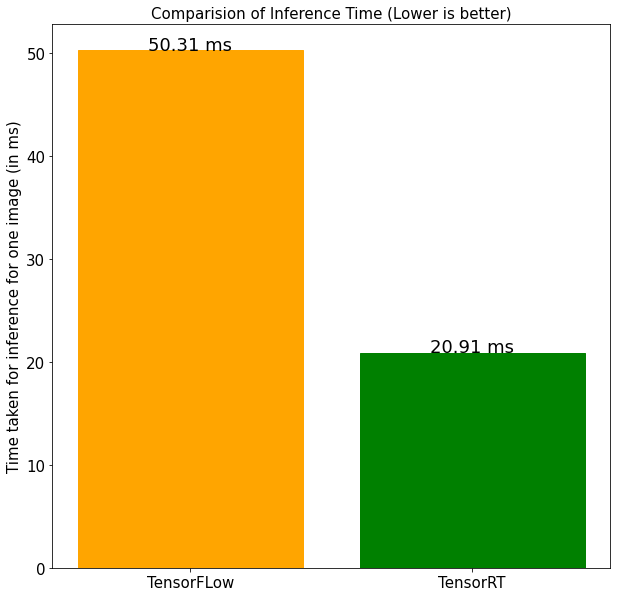

<div id="top"></div>

[![Contributors][contributors-shield]][contributors-url]
[![Issues][issues-shield]][issues-url]
[![MIT License][license-shield]][license-url]
[![LinkedIn][linkedin-shield]][linkedin-url]
<!-- [![Forks][forks-shield]][forks-url]
[![Stargazers][stars-shield]][stars-url] -->


<!-- PROJECT LOGO -->
<br />
<div align="center">
  <a href="https://github.com/deeprodge/Polyps-Detector">
    
  </a>

  <h2 align="center">Polyps Detector</h2>

  <p align="center">
    A SSD Detector that detects Polyps which is also optimized using TensorRT
    <br/>
    <!-- <a href="https://github.com/deeprodge/Polyps-Detector"><strong>Explore the docs »</strong></a>
    <br />
    <br />
    <a href="https://github.com/deeprodge/Polyps-Detector">View Demo</a>
    · -->
    <a href="https://github.com/deeprodge/Polyps-Detector/issues">Report Bug</a>
    ·
    <a href="https://github.com/deeprodge/Polyps-Detector/issues">Request Feature</a>
  </p>
</div>


<!-- TABLE OF CONTENTS -->
<details>
  <summary>Table of Contents</summary>
  <ol>
    <li>
      <a href="#about-the-project">About The Project</a>
      <ul>
        <li><a href="#more-info">More Info</a></li>
        <li><a href="#built-with">Built With</a></li>
      </ul>
    </li>
    <li>
      <a href="#getting-started">Getting Started</a>
      <ul>
        <li><a href="#prerequisites">Prerequisites</a></li>
        <!-- <li><a href="#installation">Installation</a></li> -->
      </ul>
    </li>
    <li><a href="#usage">Usage</a></li>
    <ul>
        <li><a href="#inference">Inference</a></li>
        <!-- <li><a href="#installation">Installation</a></li> -->
      </ul>
    <!-- <li><a href="#roadmap">Roadmap</a></li> -->
    <li><a href="#contributing">Contributing</a></li>
    <!-- <li><a href="#license">License</a></li> -->
    <li><a href="#contact">Contact</a></li>
    <li><a href="#useful-resources">Useful Resources</a></li>
  </ol>
</details>


<!-- ABOUT THE PROJECT -->
## About The Project
<br>
<p>
It is a Single-Shot detector finetuned to detect Polyps which are Abnormal tissue growths in gastrointestinal tract. It can be helpful to detect Polyps during Endoscopy. <br>


It is also Implemented with TF-TRT to optimizes the Inference. The optimzation result are as below:<br>


</p>

### More Info
- Used [Kvasir-SEG Dataset](https://datasets.simula.no/kvasir-seg/) for finetuning Tensorflow SSD model


<p align="right">(<a href="#top">back to top</a>)</p>


### Built With

* [Python](https://www.python.org/)
* [Tensorflow](https://pytorch.org/)
* [TensorRT](https://developer.nvidia.com/tensorrt)
* [NumPy](https://numpy.org/)
* [Pandas](https://pandas.pydata.org/)


<p align="right">(<a href="#top">back to top</a>)</p>


<!-- GETTING STARTED -->
## Getting Started

Before running the scripts, you'll need to install all the NVIDIA drivers along with TensorRT 8.0+ [(TensorRT Installation Guide)](https://docs.nvidia.com/deeplearning/tensorrt/install-guide/index.html)
Or you could also use [Tensorflow NGC](https://ngc.nvidia.com/catalog/containers/nvidia:tensorflow) container which has all TensorRT packages installed.

### Prerequisites (To Finetune)
First you need to convert the dataset to Pascal VOC Format (bboxes in XML). The dataset I'm working with (Kvasir-SEG) is in COCO format, So first I converted it to Pascal VOC using <a href="https://github.com/deeprodge/Polyps-Detector/blob/master/training_demo/Polyps%20dataset%20to%20Pascal%20VOC.ipynb">Polyps dataset to Pascal VOC.ipynb</a>.<br>
After conversion, the dataset should look like the following:<br>
```
├── images
│   ├── train
│   │   ├── image0.jpg
│   │   ├── image0.xml
│   │   .
│   │   .
│   │   ├── imagen.jpg
│   │   └── imagen.xml
│   │
│   ├── test
│   │   ├── image0.jpg
│   │   ├── image0.xml
│   │   .
│   │   .
│   │   ├── imagen.jpg
│   │   └── imagen.xml
```


Another thing to do is to create <a href="https://github.com/deeprodge/Polyps-Detector/tree/master/training_demo">training_demo</a> folder. The structure of the folder should be:

```
├── trainig_demo
│   ├── annotations
│   │   (Empty folder)
│   ├── exported_models
│   │   (This will contain the exported models)
│   ├── images
│   │   ├── train
│   │   └── test
│   │     (The dataset we created)
│   ├── models
        (This will contain the pretrained model)
```


<!-- ### Installation

_Below is an example of how you can instruct your audience on installing and setting up your app. This template doesn't rely on any external dependencies or services._

1. Get a free API Key at [https://example.com](https://example.com)
2. Clone the repo
   ```sh
   git clone https://github.com/your_username_/Project-Name.git
   ```
3. Install NPM packages
   ```sh
   npm install
   ```
4. Enter your API in `config.js`
   ```js
   const API_KEY = 'ENTER YOUR API';
   ``` -->

<p align="right">(<a href="#top">back to top</a>)</p>


<!-- USAGE EXAMPLES -->
## Usage

After setting up TensorRT and installing all the packages, you can start with Fine-Tuning. <br>
To Fine-Tune you can refer to [Tensorflow Object Detection API](https://tensorflow-object-detection-api-tutorial.readthedocs.io/en/latest/training.html)
You can also refer to [Train.ipynb](https://github.com/deeprodge/Polyps-Detector/blob/master/Train.ipynb), which is how I trained this Polyps Detector.

### Inference
For inference, you can refer to [Inference and Benchmark.ipynb](https://github.com/deeprodge/Polyps-Detector/blob/master/Inference%20and%20Benchmark.ipynb), In which I have demonstrated the optimization of the model using TF-TRT along with its inference and benchmark.


<p align="right">(<a href="#top">back to top</a>)</p>


<!-- ROADMAP -->
<!-- ## Roadmap

- [x] Add Changelog
- [x] Add back to top links
- [ ] Add Additional Templates w/ Examples
- [ ] Add "components" document to easily copy & paste sections of the readme
- [ ] Multi-language Support
    - [ ] Chinese
    - [ ] Spanish

See the [open issues](https://github.com/deeprodge/Polyps-Detector/issues) for a full list of proposed features (and known issues).

<p align="right">(<a href="#top">back to top</a>)</p> -->


<!-- CONTRIBUTING -->
## Contributing

Contributions are what make the open source community such an amazing place to learn, inspire, and create. Any contributions you make are **greatly appreciated**.

If you have a suggestion that would make this better, please fork the repo and create a pull request. You can also simply open an issue with the tag "enhancement".
Don't forget to give the project a star! Thanks again!

1. Fork the Project
2. Create your Feature Branch (`git checkout -b feature/AmazingFeature`)
3. Commit your Changes (`git commit -m 'Add some AmazingFeature'`)
4. Push to the Branch (`git push origin feature/AmazingFeature`)
5. Open a Pull Request

<p align="right">(<a href="#top">back to top</a>)</p>


<!-- CONTACT -->
## Contact

Deep Rodge - [LinkedIn](https://linkedin.com/in/deeprodge) - deeprodge14@gmail.com

Project Link: [https://github.com/deeprodge/Polyps-Detector](https://github.com/deeprodge/Polyps-Detector)

<p align="right">(<a href="#top">back to top</a>)</p>


<!-- ACKNOWLEDGMENTS -->
## Useful Resources

* [TensorRT Documentation](https://docs.nvidia.com/deeplearning/tensorrt/developer-guide/index.html)
* [Tensorflow NGC](https://ngc.nvidia.com/catalog/containers/nvidia:tensorflow)
* [Tensorflow Object Detection API](https://tensorflow-object-detection-api-tutorial.readthedocs.io/en/latest/training.html)
* [Kvasir-SEG Dataset](https://datasets.simula.no/kvasir-seg/)

<p align="right">(<a href="#top">back to top</a>)</p>


<!-- MARKDOWN LINKS & IMAGES -->
<!-- https://www.markdownguide.org/basic-syntax/#reference-style-links -->
[contributors-shield]: https://img.shields.io/github/contributors/deeprodge/Polyps-Detector
[contributors-url]: https://github.com/deeprodge/Polyps-Detector/graphs/contributors
[forks-shield]: https://img.shields.io/github/forks/deeprodge/Polyps-Detector.svg?style=for-the-badge
[forks-url]: https://github.com/deeprodge/Polyps-Detector/network/members
[stars-shield]: https://img.shields.io/github/stars/deeprodge/Polyps-Detector.svg?style=for-the-badge
[stars-url]: https://github.com/deeprodge/Polyps-Detector/stargazers
[issues-shield]: https://img.shields.io/github/issues/deeprodge/Polyps-Detector.svg?style=for-the-badge
[issues-url]: https://github.com/deeprodge/Polyps-Detector/issues
[license-shield]: https://img.shields.io/github/license/deeprodge/Polyps-Detector.svg?style=for-the-badge
[license-url]: https://github.com/deeprodge/Polyps-Detector/blob/main/LICENSE
[linkedin-shield]: https://img.shields.io/badge/-LinkedIn-black.svg?style=for-the-badge&logo=linkedin&colorB=555
[linkedin-url]: https://linkedin.com/in/deeprodge
[product-screenshot]: images/screenshot.png
